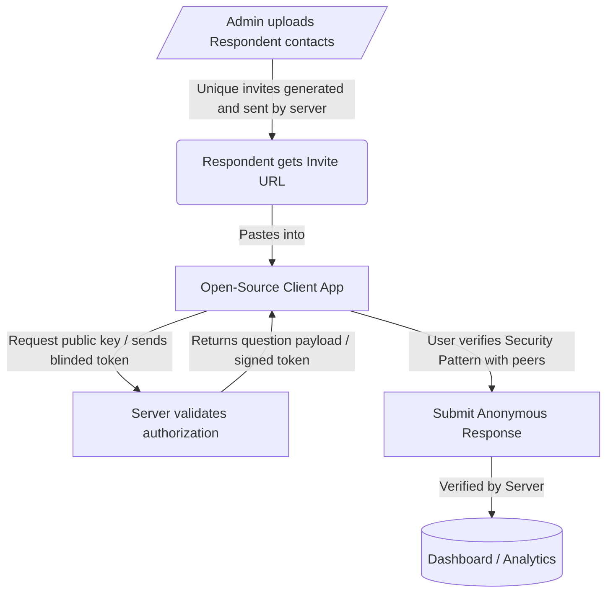
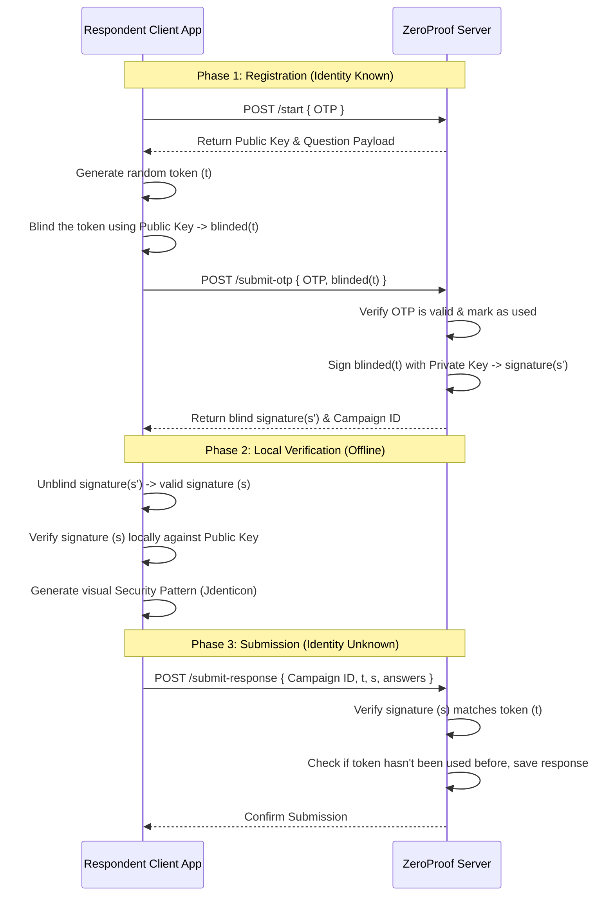

<div align="center">
  <p>
    
  </p>

  # ZeroProof
  **Anonymous feedback. No trust required.**


  *Hackathon Submission by **Team SnackOverflow** at **[Binary V2](https://binaryvtwo.devfolio.co/)**.* <br>
  [Farhan Rahaman](https://github.com/farhanr22) &bullet; [Nandan Manna](https://codernandan.in) &bullet; [Sayan Chandra](https://www.linkedin.com/in/sayan-chandra-407771318) &bullet; [Somnath Pandit](https://www.linkedin.com/in/somnath-pandit-83ba91364/)

  [](https://devfolio.co/projects/zeroproof-3ebb)&nbsp;&nbsp;
  [](https://zeroproof.pages.dev/)

  **[Problem](#problem-statement) &nbsp;•&nbsp; [Solution](#our-solution) &nbsp;•&nbsp; [Repo Structure](#repo-structure) &nbsp;•&nbsp; [Protocol Details](#protocol-details)**


</div>

---

## Problem Statement

Organizations need honest input, and respondents need real privacy. However, existing feedback solutions fall into one of two categories:

*   **Public Forms (No Login):** Open to spam, manipulation, and abuse. A single user could submit multiple times and alter the consensus.
*   **Authenticated / Tracked Forms:** Whether it's a corporate survey tool or a Google Form with login, there is theoretically enough information out there to link your identity to your response. You aren't mathematically anonymous; you are trusting the platform to not connect the dots.

Both approaches require some kind of compromise. We wanted to build a solution that allowed organizations to authorize a group of respondents for providing feedback (once), while ensuring the anonymity of respondents *within that group*.

## Our Solution

ZeroProof removes "trust" from the equation. We built a system that allows an organization to enable single responses, without the server being able to know *which* authorized user submitted *which* response. 

This is achieved by having a dedicated, open-source client application for respondents which implements the cryptographic protocol, and allows verification of the setup through a visual *Security Pattern* that should be the same for all respondents.

The system has three major parts:
- **The Admin Web App:** Used by the organization to manage contacts, build the questionnaire, view responses and send Invite URLs.
- **The Open-Source Client:** A static web app used by the respondent implementing the protocol. It is open-source, and can be audited by anyone.
- **The Protocol:** Based on **RSA Blind Signatures**, it works by exchanging the unique invite URL for an unlinkable "voting ticket".


### High-Level Workflow



---

## Repo Structure

This repository contains multiple components:

```text
zeroproof/
├── admin-client/      # React SPA for admin functions
├── response-client/   # React SPA for respondents 
├── server/            # Express + MongoDB based API
├── otp-sender/        # Node.js tool for sending Invite URLs
├── terminal-clients/  # Clients for local MVP demo
└── agents/            # Planning & specifications
```

**Notes**
- The [cloudflare/blindrsa-ts](https://github.com/cloudflare/blindrsa-ts) library is used for cryptographic operations.
- The visual *Security Pattern* is rendered on the respondent client app using the [jdenticon](https://github.com/dmester/jdenticon) library.
- The admin application provides AI features (Question Generation, Results Analysis) using the [openai/openai-node](https://github.com/openai/openai-node) library and works with any compatible provider.
- The `otp-sender/` tool is a terminal-based program that allows logging in with a WhatsApp account and polls the server for new Invite URLs to send to contacts. Alternatively, it can simply print them to the terminal.


---

## Protocol Details

ZeroProof operates on the principle that even if the server is fully adversarial, it should not be able to link a response to the identity of a respondent. This is achieved through a cryptographic flow based on RSA Blind Signatures and social proof. 

- To ensure that the server is using the same key pair and question payload for all the respondents, a visual *Security Pattern* is generated using those two pieces of information, for comparison by the respondents. 

- To mitigate the threat of correlation via timing or network access based logs, we instruct the respondents within the application to coordinate submission timings with their group and switch networks during submission.

### Sequence Diagram



